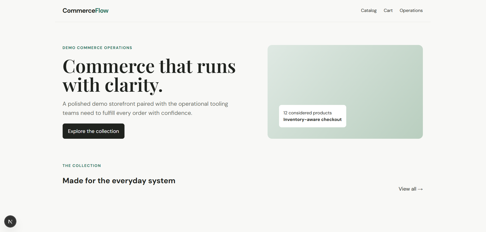
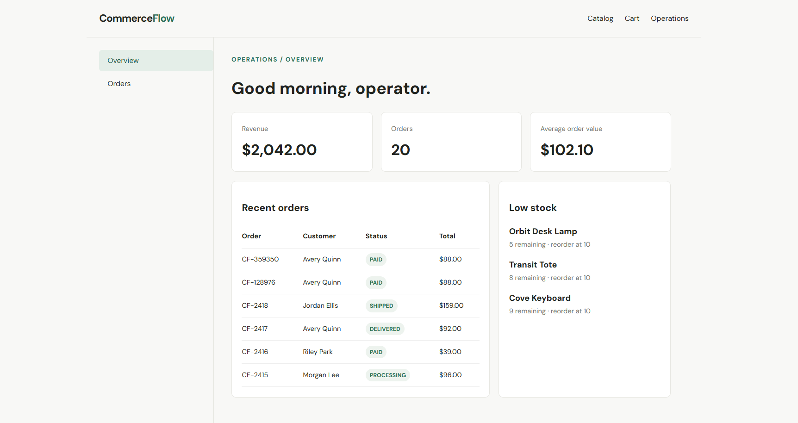

# CommerceFlow

A full-stack commerce and order operations platform demonstrating transactional checkout, inventory management, payments, analytics, caching, and operational workflows.

`Next.js` · `TypeScript` · `NestJS` · `PostgreSQL` · `Prisma` · `Redis` · `Docker`

## Preview

### Storefront



### Operations Dashboard



## What it demonstrates

- Customer storefront, product catalog, cart, and checkout flow
- Server-authoritative pricing, coupon validation, and quantity validation
- Transactional inventory decrement with order, payment, and activity records
- Idempotent checkout and duplicate-safe demo payment webhook handling
- Order and payment lifecycle visibility in an operations dashboard
- Database-derived revenue, order count, average order value, and low-stock monitoring
- Redis-backed dashboard analytics cache with PostgreSQL fallback
- PostgreSQL + Prisma relational data model and Dockerized local infrastructure
- CI-oriented build, lint, typecheck, and focused service tests

## Architecture

The Next.js web application calls a NestJS REST API. Prisma persists commerce data in PostgreSQL, while Redis provides a short-lived cache for dashboard analytics.

See [architecture documentation](docs/architecture.md) and the [checkout flow](docs/checkout-flow.md).

## Checkout integrity

Checkout validates a positive integer quantity for every item, reads current product prices from the database, validates available inventory and coupons, and calculates all totals server-side. Inventory, order, order item, payment, and activity writes run in one transaction. A unique idempotency key returns the existing order for duplicate checkout requests.

## Local development

Copy the local API environment file, install dependencies, start PostgreSQL and Redis, then migrate and seed the database:

```bash
cp .env.example apps/api/.env
pnpm install
docker compose up -d
pnpm db:migrate -- --name init
pnpm db:seed
pnpm dev
```

Open `http://localhost:3000`; the API runs at `http://localhost:4000/api`. `.env.example` contains the local PostgreSQL, Redis, and API defaults.

## Quality checks

```bash
pnpm build
pnpm lint
pnpm typecheck
pnpm test
```

## Demo scope

- Uses a deterministic demo payment provider; no real payment data is collected.
- Includes seeded fictional identities, products, orders, coupons, and inventory data.
- Authentication and authorization for operations are intentionally outside the current demo scope.
- CommerceFlow is a portfolio demo and is not presented as a production payment system.
