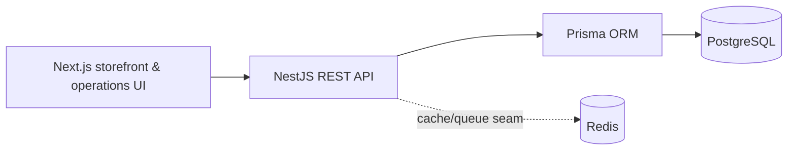

# Architecture

The relational schema uses UUID primary keys, money decimals, enum lifecycles, unique SKU/order/idempotency/event constraints, and indexed product/order query paths. The dashboard is always computed from persisted orders rather than UI constants.
