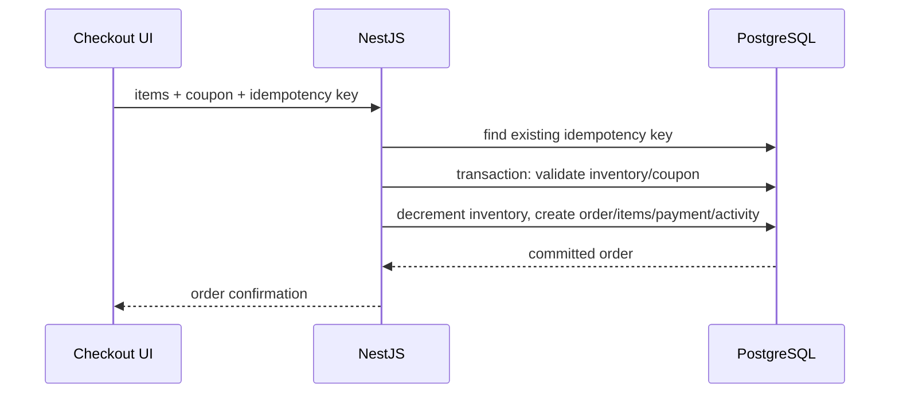

# Checkout and webhook flow

The webhook endpoint persists `providerEventId` under a unique constraint before applying state changes. A retry of the same event returns `duplicate: true`, preventing duplicate processing. A real provider adapter would verify its signature before this boundary.
